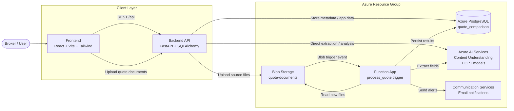

# Quote Comparison App

Commercial property insurance quote comparison tool with AI-powered analysis.

## Full Setup Guide

For complete local setup, Azure provisioning, deployment, verification, and troubleshooting steps, see [`SETUP_GUIDE.md`](./SETUP_GUIDE.md).

For a quick go-live list, see [`DEPLOYMENT_CHECKLIST.md`](./DEPLOYMENT_CHECKLIST.md).

## Architecture Diagram



### Flow Summary

1. Users upload and review quotes in the React UI.
2. The FastAPI backend stores app data and handles API requests.
3. Quote files are stored in Azure Blob Storage.
4. The Azure Function processes new files, calls Azure AI Services, and writes extracted data to PostgreSQL.
5. Optional email notifications are sent after processing.

## Tech Stack

| Layer    | Technology                          |
|----------|-------------------------------------|
| Frontend | React 18, TypeScript, Vite, Tailwind CSS |
| Backend  | Python, FastAPI, SQLAlchemy 2.0     |
| Database | PostgreSQL                          |
| AI       | Azure OpenAI GPT-4o                 |
| Storage  | Azure Blob Storage                  |
| Deploy   | Azure App Service / Docker          |

## Quick Start

### Prerequisites
- Node.js 20+, Python 3.12+, PostgreSQL 16+
- (Optional) Docker & Docker Compose

### Run with Docker Compose

```bash
cp backend/.env.example backend/.env   # edit with your credentials
docker compose up --build
```
- Frontend: http://localhost:3000
- Backend API: http://localhost:8000/docs

### Run Locally

**Backend:**
```bash
cd backend
python -m venv .venv && .venv\Scripts\activate   # Windows
pip install -r requirements.txt
cp .env.example .env                              # edit DATABASE_URL, etc.
uvicorn app.main:app --reload
python seed_data.py                               # seed sample data
```

**Frontend:**
```bash
cd frontend
npm install
npm run dev
```
Vite dev server proxies `/api` to the backend at `http://localhost:8000`.

## Project Structure

```
backend/
  app/
    api/          # FastAPI route modules
    agents/       # Azure OpenAI AI agents
    models/       # SQLAlchemy ORM models
    schemas/      # Pydantic request/response schemas
    services/     # Business logic (blob, document parser, scoring)
    config.py     # Settings from .env
    database.py   # DB engine & session
    main.py       # FastAPI application factory
  alembic/        # Database migrations
  seed_data.py    # Sample data seeder

frontend/
  src/
    api/          # Backend API client
    components/   # React components (layout, comparison, ui)
    data/         # Sample/fallback data
    pages/        # Dashboard & ComparisonView pages
    types/        # TypeScript interfaces
    utils/        # Formatters, scoring, gap detection
```

## License

Copyright (c) Microsoft Corporation. All rights reserved.

Licensed under the MIT License.

## Disclaimer

This project is provided as a **sample/demo application** for reference purposes only. It is not intended for production use without additional security review, compliance validation, performance testing, and operational hardening.

**THIS SAMPLE IS PROVIDED "AS IS" WITHOUT WARRANTY OF ANY KIND**, EXPRESS OR IMPLIED, INCLUDING BUT NOT LIMITED TO THE IMPLIED WARRANTIES OF MERCHANTABILITY, FITNESS FOR A PARTICULAR PURPOSE, AND NON-INFRINGEMENT.
